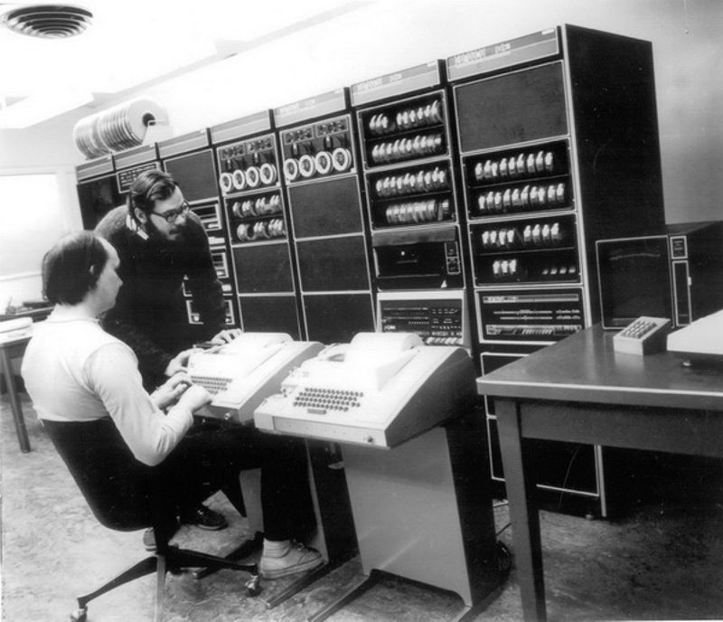

<!--
_header: CC2632 - Desenvolvimento de Algoritmos
_footer: Leonardo Anjoletto Ferreira
-->
# Aula 01 - Introdução


---

### Assuntos
- Sobre a disciplina
- Introdução a disciplina
- Tipos de valores e exibição
- Leitura de valores do teclado

---

# Por que desenvolvimento de algoritmos?

---

### No semestre passado...

- Introdução a lógica de programação
- Linguagem (Python) + lógica de programação
- **Vantagens:** Python abstrai muitas coisas da programação e facilita o estudo da lógica
- **Desvantagens:** Python abstrai muitas coisas da programação e podemos não saber o que está acontecendo

---

### Neste semestre...
- Desenvolvimento de algoritmos
- Linguagem C + lógica de programação
- **Objetivo:**
  - desenvolver soluções genéricas de problemas usando lógica
  - entender como isso é feito em mais baixo nível (do que Python)

---

### C?

- Linguagem antiga mas muito usada
- Base para alguns sistemas operacionais (UNIX, Linux, MacOS)
- Sintaxe usada como base para diversas linguagens (C++, Java, C#,...)
- Linguagem compilada (executável é gerado a partir do código escrito)
- Permite que o programador tenha mais controle sobre o programa (uso de registradores de CPU, alocação de memória, paralelismo...)
- Ainda muito utilizada

---



---

### PDP-7 em funcionamento

[Living computer museum + labs](https://youtu.be/pvaPaWyiuLA)

---

### C vs Python

-                |     C       | Python
-----------------|-------------|-------------
**Nível**        | Baixo       | Alto
**Execução**     | Compilada   | Interpretada
**Variáveis**    | Tipo fixo   | Tipo dinâmico
**Ger. Memória** | Programador | Garbage Collector
**Paradigma**    | Estruturado | Vários (OOP, Funcional, Estruturado)

---

# Primeiro programa em C

---

### Hello, world

Python:
```python
print("Hello, world!")
```

---

### Hello, world

C:
```c
#include <stdio.h>

void main() {
    printf("Hello, world!");
}
```

```c
#include <stdio.h>

int main() {
    printf("Hello, world!");
    return 0;
}
```

---

# Tipos de valores e exibição

---

### Tipos de variáveis e formatação

<!--_class: center-->
```c
#include <stdio.h>

int main() {

    int i = 1; // tipo inteiro
    float f = 3.14; // ponto flutuante
    char c = 'a';

    printf("Inteiro: %d\n", i);
    printf("Ponto flutuante: %f\n", f);
    printf("Letra: %c\n", c);

    return 0;
}
```

---

### Tipos de variáveis

 tipo    | descrição
---------|-----------
`short`  | inteiro de 2 bytes
`int`    | inteiro de 4 bytes
`long`   | inteiro de 8 bytes
`float`  | ponto flutuante de 4 bytes
`double` | ponto flutuante de 8 bytes
`char`   | inteiro de 1 byte...

`string` será visto mais a frente no curso

---

### Tipos de variáveis

- Os tipos numéricos podem ser *signed* (com sinal, podendo ser positivo ou negativo) ou *unsigned* (sem sinal, iniciando com valor 0)
- `signed char` vai de -128 a 127
- `unsigned char` vai de 0 a 255
- por padrão, as variáveis são `signed`

Estas opções são úteis quando queremos ter mais controle sobre o valor que uma variáveis pode assumir, permitindo melhor uso dos recursos.

---

### Formatação - 1 (variáveis)

 tipo                    | símbolo
-------------------------|-----------
`signed short`/`int`     | %d ou %I
`unsigned short`/`int`   | %u
`signed long`            | %ld
`unsigned long`          | %lu
`unsigned` octal         | %o
`unsigned` hexadecimal   | %x

---

### Formatação - 2 (variáveis)

 tipo                    | símbolo
-------------------------|-----------
`float`                  | %f
`double`                 | %lf
`unsigned`/`signed char` | %c
`string`                 | %s

---


### Formatação - 3 (caracteres)

 função          | símbolo
-----------------|-----------
quebra de linha  | \n
tabulação        | \t
backspace        | \b
retorno de carro | \r
nova linha       | \f
Null             | \0


---

### Inicialização de variáveis

```c
#include <stdio.h>

void main() {
    int i;
    pritf("%d\n",i);
}
```

---

### Operadores

```c
#include <stdio.h>

void main() {
    int i = 1;
    int j = 2;

    int soma = i + j;
    int subtracao = i - j;
    int multiplicacao = i * j;
    int divisao = i / j;
    int resto = i % j;
    int incremento = i++; // ou ++i
    int decremento = i--; // ou --i
}
```

---

# Leitura do teclado

---

## Leitura do teclado

```c
#include <stdio.h>

int main(){
    int i;
    scanf("%d", &i);
    printf("%d", i);
}
```

---

## Leitura do teclado

```c
#include <stdio.h>

int main(){
    float f;
    scanf("%f", &f);
    printf("%f", f);
}
```

---

## Leitura do teclado

```c
#include <stdio.h>

int main(){
    char c;
    scanf("%c", &c);
    printf("%c", c);
}
```

---

## Exercício

1. Faça um programa que pergunte para o usuário 5 números inteiros e imprima o resultado da soma.
2. Faça o mesmo usando números de ponto flutuante.
